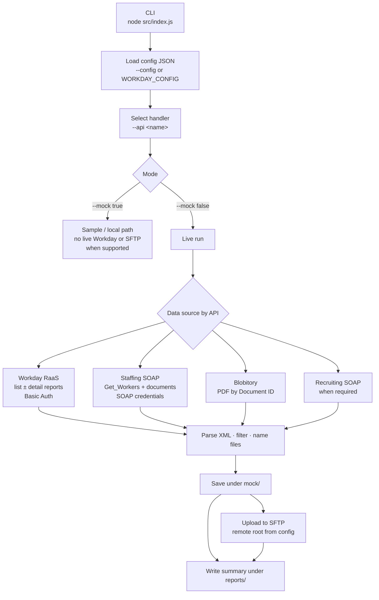
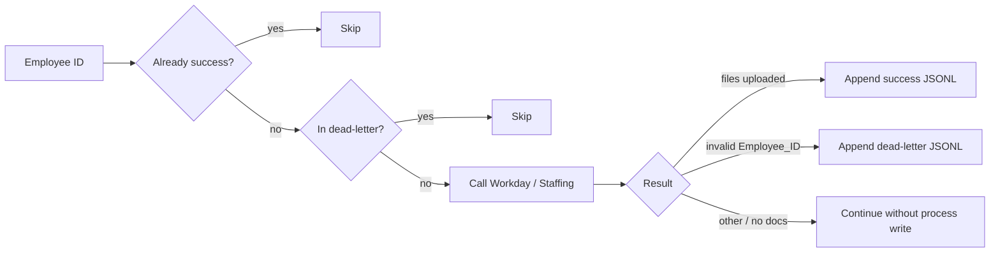
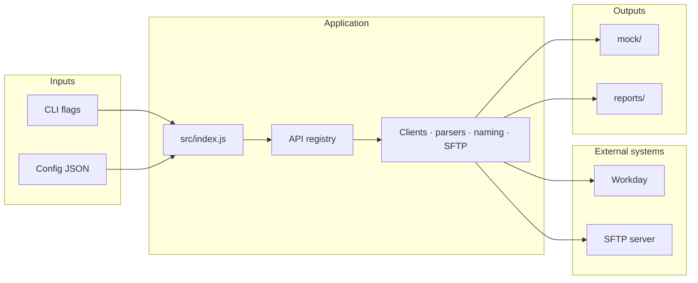

# Workday API Client

Node.js CLI that pulls employee document data from Workday (RaaS reports, Staffing SOAP, Blobitory, Recruiting) and writes files locally under `mock/`, with optional upload to Infor SFTP.

**Requirements:** Node.js **18+** and npm.

---

## How the app works



**Typical live flow (per API):**

1. Load tenant credentials and endpoints from a configuration file.  
2. Load a worker list (RaaS list report or equivalent).  
3. For each worker (batched, with concurrency), fetch document content.  
4. Save files under `mock/` using the API’s path convention.  
5. Upload to SFTP under the configured remote root.  
6. Write a JSON/Markdown run summary under `reports/`.

Not every API uses every source (some are RaaS-only, some Staffing-only, some Blobitory). Use `--list-apis` for the full set of handlers.

---

## Install Node.js and npm

### Windows

**Option A — Official installer**

1. Open [https://nodejs.org/](https://nodejs.org/) and download the **LTS** installer.  
2. Run the installer (include npm; leave “Add to PATH” enabled).  
3. Open a **new** PowerShell or Command Prompt window:

```powershell
node -v
npm -v
```

**Option B — winget**

```powershell
winget install OpenJS.NodeJS.LTS
```

Close and reopen the terminal, then check `node -v` and `npm -v`.

### macOS

**Option A — Official installer**

1. Download the **LTS** package from [https://nodejs.org/](https://nodejs.org/).  
2. Install, then open Terminal:

```bash
node -v
npm -v
```

**Option B — Homebrew**

```bash
brew install node
node -v
npm -v
```

---

## Project setup

From the project root:

```bash
npm install
```

Dependencies: `dotenv`, `fast-xml-parser`, `ssh2-sftp-client`.

---

## Configuration (required)

Every live run needs a config file via **`--config <path>`** or the **`WORKDAY_CONFIG`** environment variable. There is **no default** path.

### Config file shape

```json
{
  "soapCredentials": {
    "User": "integration_user@tenant_name",
    "Password": "********"
  },
  "basicCredentials": {
    "User": "integration_user",
    "Password": "********"
  },
  "sftpCredentials": {
    "Host": "sftp.example.com",
    "Port": 22,
    "User": "sftp_user",
    "Password": "********",
    "RemoteRoot": "/ROI/Workday",
    "PoolSize": 3
  },
  "Tenant_domain": "wdX-impl-services1.workday.com",
  "Tenant_server": "your_tenant"
}
```

| Field | Used for |
|-------|----------|
| `basicCredentials` | Workday RaaS (Basic Auth) |
| `soapCredentials` | Staffing / Blobitory SOAP-style auth (`user@tenant`) |
| `sftpCredentials` | Infor (or other) SFTP uploads |
| `sftpCredentials.PoolSize` | Concurrent SFTP connections (**1–3**, default **3**) |
| `Tenant_domain` | Host for Workday service URLs |
| `Tenant_server` | Tenant name in Workday URLs |

Optional per-field overrides: set `WORKDAY_*` or `SFTP_*` in the environment (or a local `.env`; see `.env.example`). File values apply when overrides are unset.

Keep real passwords out of git; use env-specific config files outside version control when possible.

---

## Performance and reliability features

These features support large (full-population) runs.

### Parallel Workday calls (`--concurrency`)

| Setting | Value |
|---------|--------|
| CLI flag | `--concurrency <n>` |
| Default | **6** |
| Recommended band | **5–8** |

Controls how many workers are processed in parallel within a batch (Staffing `Get_Workers`, RaaS detail, Blobitory downloads, etc.). Higher values finish faster but may increase Workday load or transient faults.

```bash
node src/index.js --api education --config ./path/to/config.json --mock false \
  --max-employees 50 --concurrency 8
```

### SFTP connection pool

Uploads no longer share a single serialized connection. The uploader opens a **pool** of SFTP sessions:

| Setting | Value |
|---------|--------|
| Default pool size | **3** |
| Allowed range | **1–3** (clamped) |
| Config | `sftpCredentials.PoolSize` |
| Env override | `SFTP_POOL_SIZE` |

Up to `PoolSize` files upload at the same time while Workday fetches continue on other workers.

```bash
# PowerShell example: 3 SFTP connections + 8 API workers
$env:SFTP_POOL_SIZE = "3"
node src/index.js --api personal --config .\path\to\config.json --mock false --concurrency 8
```

### Process files (success + dead-letter)

For the **personal** API (and available as a shared library for other APIs), employee outcomes are recorded as JSONL under `reports/process/`:

| File | Purpose |
|------|---------|
| `reports/process/{api}-success-ids.jsonl` | Workers finished successfully — **skipped** on re-run |
| `reports/process/{api}-dead-letter-ids.jsonl` | Permanent failures (e.g. invalid `Employee_ID`) — **no retry** |

Example success line:

```json
{"employeeId":"42022","api":"personal","at":"2026-08-05T02:00:00.000Z","files":2}
```

Example dead-letter line:

```json
{"employeeId":"32967","api":"personal","reason":"invalid_employee_id","at":"2026-08-05T02:00:00.000Z"}
```

**Rules:**

1. Before calling Workday/Staffing, if the employee is already in **success** → skip.  
2. If Staffing rejects an invalid `Employee_ID` → append **dead-letter** and continue (do not fail the whole job).  
3. Invalid IDs are **not** retried automatically.  
4. Re-running the same API is safe: completed workers are not re-downloaded.



### Unit tests

```bash
npm test
# or
node --test tests/*.test.js
```

Coverage includes CLI parsing, file naming, concurrency pool behavior, personal document filters, process-tracker rules, and SFTP pool size clamping.

---

## CLI usage

```text
node src/index.js --api <name> --config <path> [options]
node src/index.js --list-apis
node src/index.js --help
```

### Required (for a real API run)

| Flag | Description |
|------|-------------|
| `--api <name>` | Handler to run (see `--list-apis`) |
| `--config <path>` | Path to configuration JSON (or set `WORKDAY_CONFIG`) |

### Common options

| Flag | Default | Description |
|------|---------|-------------|
| `--mock <true\|false>` | `false` | `true` = sample/local path when implemented; `false` = live Workday + SFTP |
| `--page-size <n>` | `5` | Workers per batch |
| `--concurrency <n>` | `6` | Parallel Workday calls per batch (try **5–8**) |
| `--max-pages <n>` | all | Stop after N batches |
| `--max-employees <n>` | varies | Cap workers processed (some APIs: per category) |
| `--worker-wid <wid>` | — | Single worker (where supported) |
| `--workers-file <path>` | — | Local worker list (where supported) |
| `--list-apis` | — | Print registered API names and exit |
| `-h`, `--help` | — | Help text |

See [Performance and reliability features](#performance-and-reliability-features) for concurrency, SFTP pool, and process files.

### List APIs

```bash
node src/index.js --list-apis
```

Example output (names grow as handlers are registered):

```text
Available APIs:

  report-info
  job-description
  education
  personal
  certification
  ...

Total: 20
```

---

## Meaningful command examples

Replace the config path with your environment’s file.

### 1. Discover APIs (no config required)

```bash
node src/index.js --list-apis
```

### 2. Live run — first 20 workers (smoke test)

```bash
node src/index.js \
  --api education \
  --config ./path/to/preview-configuration.json \
  --mock false \
  --max-employees 20 \
  --concurrency 5
```

**Windows PowerShell** (same idea, one line):

```powershell
node src/index.js --api education --config .\path\to\preview-configuration.json --mock false --max-employees 20 --concurrency 5
```

### 3. Small batch control (debug)

```bash
node src/index.js \
  --api benefit-event \
  --config ./path/to/preview-configuration.json \
  --mock false \
  --page-size 5 \
  --max-pages 1 \
  --concurrency 2
```

### 4. Personal documents (Staffing categories)

```bash
node src/index.js \
  --api personal \
  --config ./path/to/preview-configuration.json \
  --mock false \
  --max-employees 10 \
  --concurrency 8
```

For `personal`, `--max-employees` means **employees per document category** (not always a global employee cap).  
Re-runs skip IDs already in `reports/process/personal-success-ids.jsonl` and never retry dead-lettered invalid IDs.

### 5. Full-population style settings (optimized defaults)

```bash
node src/index.js \
  --api personal \
  --config ./path/to/production-configuration.json \
  --mock false \
  --concurrency 6
```

Uses default concurrency **6** and SFTP pool **3**. Override pool size if needed:

```bash
# macOS / Linux
SFTP_POOL_SIZE=2 node src/index.js --api personal --config ./path/to/config.json --mock false --concurrency 8
```

```powershell
# Windows PowerShell
$env:SFTP_POOL_SIZE = "2"
node src/index.js --api personal --config .\path\to\config.json --mock false --concurrency 8
```

### 6. Generated document / Blobitory-style export

```bash
node src/index.js \
  --api job-description \
  --config ./path/to/preview-configuration.json \
  --mock false \
  --max-employees 20
```

### 7. Use env var instead of repeating `--config`

**macOS / Linux:**

```bash
export WORKDAY_CONFIG=./path/to/production-configuration.json
node src/index.js --api pay-increase --mock false --max-employees 50
```

**Windows PowerShell:**

```powershell
$env:WORKDAY_CONFIG = ".\path\to\production-configuration.json"
node src/index.js --api pay-increase --mock false --max-employees 50
```

### 8. Missing config (expected error)

```bash
node src/index.js --api education --mock false
```

Exits with an error that `--config` (or `WORKDAY_CONFIG`) is required.

---

## Outputs

| Location | Contents |
|----------|----------|
| `mock/` | Local copies of downloaded files (also used as staging for SFTP) |
| `reports/` | Per-run JSON and Markdown summaries (`{api}-latest.md`, timestamped runs) |
| `reports/process/` | Success and dead-letter employee ID JSONL files (personal API) |
| SFTP remote root | Uploaded files under paths defined by each API’s naming rules |

`mock/` and most of `reports/` are gitignored by default (process files under `reports/process/` are local state for re-runs).

---

## High-level architecture



| Area | Role |
|------|------|
| `src/index.js` | Entry point, validates flags, loads config |
| `src/apis/` | One handler per `--api` value |
| `src/lib/` | HTTP/SOAP clients, XML parsing, parallel batching, file naming, SFTP pool, process tracker, run reports |
| `src/lib/sftp-client.js` | SFTP connection pool (1–3 concurrent uploads) |
| `src/lib/process-tracker.js` | Success / dead-letter JSONL helpers |
| `src/lib/parallel.js` | `mapPool` for API concurrency |
| `src/config.js` | Config load, tenant URL builders, credential accessors |
| `tests/` | Unit tests (`npm test`) |

---

## npm scripts

```bash
npm start -- --list-apis
npm start -- --api education --config ./path/to/config.json --mock false --max-employees 5
npm test
```

(`npm start` runs `node src/index.js`; pass CLI args after `--`. `npm test` runs unit tests under `tests/`.)

---

## Troubleshooting

| Issue | What to check |
|-------|----------------|
| `--config is required` | Pass `--config` or set `WORKDAY_CONFIG` |
| Config file not found | Path relative to current directory or project root |
| Invalid JSON / missing fields | Schema must include soap, basic, tenant domain/server |
| Workday 401 / SOAP fault | Credentials and tenant name for that environment |
| Invalid Employee_ID | Some list IDs are not valid for Staffing; personal API dead-letters them under `reports/process/` |
| Re-download after crash | Personal API skips IDs already in the success process file |
| SFTP failures | Host, port, user, password, remote root, network allowlist; try lowering `SFTP_POOL_SIZE` |
| Workday timeouts under load | Lower `--concurrency` toward 5 |

---

## License / notes

Internal integration tool. Do not commit secrets. Prefer separate config files per environment (preview, sandbox, production).
